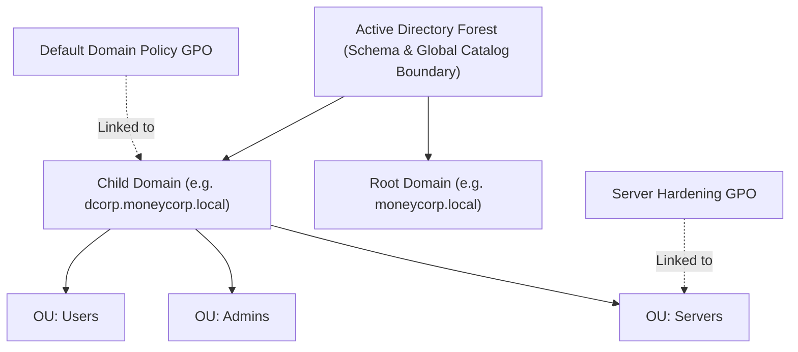
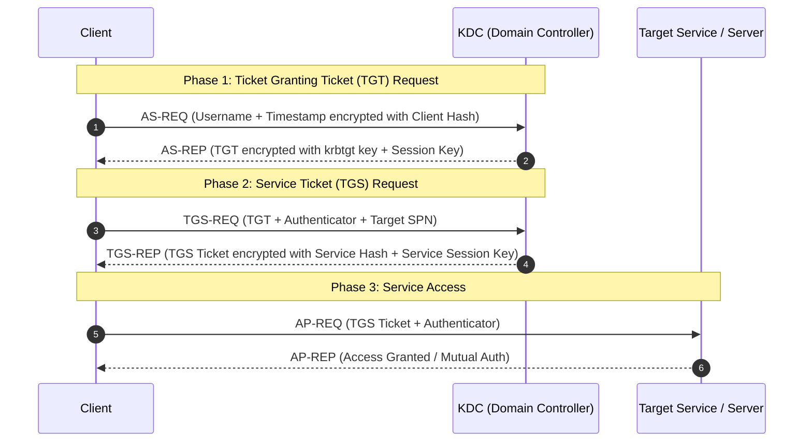
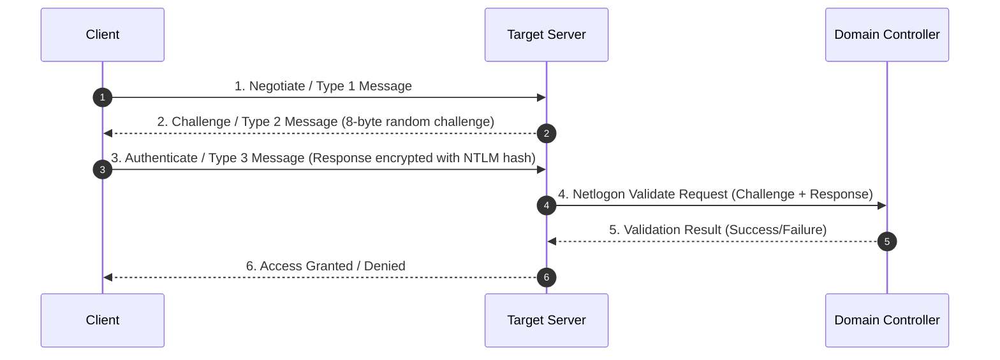

# 01 — AD + PowerShell Foundations

> [!NOTE]
> Active Directory (AD) serves as Microsoft's centralized Identity and Access Management (IAM) infrastructure. Understanding the underlying authentication flows (Kerberos and NTLM) is mandatory before attempting domain exploitation.

---

## Security Principals & Objects

- **Users:** Individual user identities authenticated by the Domain Controller (DC).
- **Computers/Machines:** Machine identities represented in AD with a trailing `$` (e.g., `DC01$`, `WEBSRV01$`). Machine account passwords rotate automatically every 30 days by default.
- **Groups:** Security groups used to assign rights and permissions to users/computers.
- **Service Accounts:** Accounts used to run services/daemon processes (Managed Service Accounts, gMSAs, or standard user accounts with SPNs).

---

## Active Directory Core Architecture

An Active Directory environment is structured hierarchically across Forests, Domains, and Organizational Units (OUs).



### Core Services
- **Schema:** Defines all object classes and attributes allowed in the directory.
- **Global Catalog (GC):** A distributed data repository containing a searchable subset of attributes for every object in the forest (Port 3268/3269).
- **Replication Service:** Synchronizes directory updates across all Domain Controllers using RPC (MS-DRSR).
- **Group Policy Objects (GPOs):** Configurations applied to Sites, Domains, or OUs to enforce security settings and user environment policies.

---

## Kerberos Authentication Architecture

Kerberos is the primary authentication protocol in Active Directory (Port 88). It relies on symmetric key cryptography and trusted third-party Key Distribution Centers (KDC, running on DCs).



> [!IMPORTANT]
> - **TGT Encryption:** Encrypted with the `krbtgt` account password hash/AES key. Anyone with the `krbtgt` hash can forge a TGT (**Golden Ticket**).
> - **TGS Encryption:** Encrypted with the service account password hash/AES key. Anyone with the service account hash can forge a TGS (**Silver Ticket**).

---

## NTLM Challenge/Response Authentication

NTLM is used when Kerberos is unavailable (e.g., connecting via IP address, cross-forest non-transitive trusts, or legacy applications).



> [!WARNING]
> **Relay Risks:** NTLM Type 3 responses can be relayed to target hosts if SMB Signing or HTTP Extended Protection for Authentication (EPA) is not enforced.

---

## LDAP & Directory Operations

- **LDAP (Lightweight Directory Access Protocol):** Protocol used to query and update directory objects (Port 389, LDAPS Port 636).
- **LDAP Pass-Back Attack:** Threat vector where rogue network devices or misconfigured printers pass back credentials via clear-text LDAP authentication requests to an attacker-controlled listener.

---

## PowerShell Scripting & Module Loading

PowerShell is built on the `.NET Framework` (`System.Management.Automation`).

```powershell
# Dot-sourcing loads functions into the current session scope
. C:\AD\Tools\PowerView.ps1

# Import-Module loads binary/script modules
Import-Module C:\AD\Tools\ADModule-master\ActiveDirectory\ActiveDirectory.psd1

# Enumerate exported module cmdlets
Get-Command -Module ActiveDirectory
```

---

## PowerShell Security Bypasses & AV Evasion

> [!TIP]
> Modern EDR and Windows Defender monitor PowerShell execution via **AMSI (Antimalware Scan Interface)** and **Script Block Logging**.

### Signature & AMSI Evasion Concepts
- **Invisi-Shell:** Hooks .NET assemblies to bypass AMSI and PowerShell logging.
  - Admin execution: `RunWithPathAsAdmin.bat`
  - Non-admin execution: `RunWithRegistryNonAdmin.bat`
- **DefenderCheck:** Utility to identify exact offset locations flagged by Defender signatures (`DefenderCheck.exe <File>`).
- **Byte Patching / Obfuscation:** Modifying flagged strings or byte strings in scripts like `PowerUp.ps1` before execution.

```text
C:\AD\Tools\DefenderCheck.exe
C:\AD\Tools\PowerUp.ps1
```
