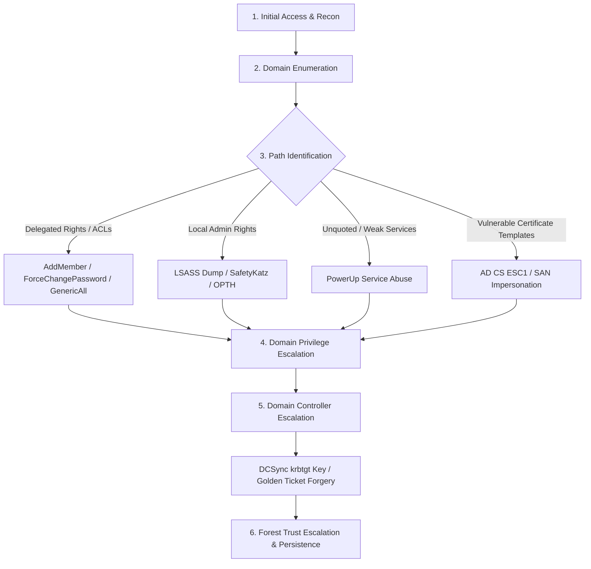

# Certified Red Team Professional (CRTP) — Digital Exam Notes

---

## Navigation

| Module | Topic | Link |
| :--- | :--- | :--- |
| **00** | Quick Reference — Command Matrices, Kerbrute, Impacket, Bloody-AD | [00-QUICK-REFERENCE.md](00-QUICK-REFERENCE.md) |
| **01** | AD Foundations, Kerberos, NTLM, AMSI Bypasses | [01-FOUNDATIONS.md](01-FOUNDATIONS.md) |
| **02** | Domain, User, Computer, Group, GPO, OU & Trust Enumeration | [02-ENUMERATION.md](02-ENUMERATION.md) |
| **03** | ACL Abuse, GPO Relay, Jenkins Reverse Shells, Delegation | [03-ACL-GPO-JENKINS.md](03-ACL-GPO-JENKINS.md) |
| **04** | Local Admin Hunting, WinRM, WMI, SCM, Netsh Portproxy | [04-LATERAL-MOVEMENT.md](04-LATERAL-MOVEMENT.md) |
| **05** | Kerberoasting, AS-REP Roasting, LSASS, OPTH, DCSync | [05-CREDENTIAL-ACCESS.md](05-CREDENTIAL-ACCESS.md) |
| **06** | Golden/Silver Tickets, S4U Constrained Delegation, RBCD | [06-KERBEROS-DELEGATION.md](06-KERBEROS-DELEGATION.md) |
| **07** | AD CS ESC1, Certificate Forgery, SIDHistory Persistence | [07-ADCS-PERSISTENCE.md](07-ADCS-PERSISTENCE.md) |
| **08** | Credential Hunting — PSReadLine, KeePass, Vaults, VSS, NTDS | [08-CREDENTIAL-HUNTING.md](08-CREDENTIAL-HUNTING.md) |

---

## Placeholder Matrix

Replace these across all commands with your lab/exam values:

| Placeholder | Example | Description |
| :--- | :--- | :--- |
| `<DOMAIN>` | `dcorp.moneycorp.local` | Target Domain FQDN |
| `<DOMAIN_SHORT>` | `dcorp` | NetBIOS Domain Name |
| `<USER>` | `studentx` | Current / Compromised Account |
| `<TARGET>` | `dcorp-adminsrv.dcorp.moneycorp.local` | Target Computer FQDN |
| `<DC>` | `dcorp-dc.dcorp.moneycorp.local` | Domain Controller Hostname |
| `<DC_IP>` | `172.16.2.1` | Domain Controller IP |
| `<AES256_KEY>` | `e61a...` | Kerberos AES256 Key |
| `<NTLM_HASH>` | `2b57...` | NTLM Password Hash |
| `<DOMAIN_SID>` | `S-1-5-21-3537233777-2717541362-1549646036` | Domain SID |
| `<KRBTGT_AES256>` | `c4d9...` | krbtgt AES256 Key |
| `<CERT_PFX>` | `C:\AD\Tools\cert.pfx` | PKCS#12 Certificate |

---

## Exam Attack Flow

> [!TIP]
> Systematically enumerate at each hop before escalating. Preserve ticket artifacts (`.kirbi` / `.pfx`) in `C:\AD\Tools\` for session re-entry.

---

## Author

- **Author:** Gokul Amaran
- **LinkedIn:** [linkedin.com/in/gokulamaran](https://linkedin.com/in/gokulamaran)
- **Website:** [gokulamaran.me](https://www.gokulamaran.me)
