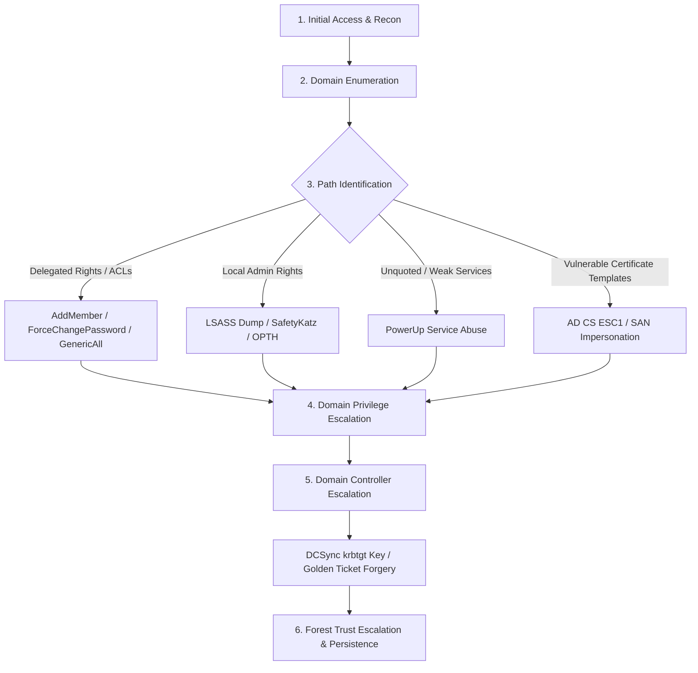

# Certified Red Team Professional (CRTP) Digital Exam Notes & Cheat Sheet

> [!NOTE]
> Digitalized and refined from a comprehensive **59-page handwritten CRTP exam note set**. Formatted specifically for rapid command lookup during active lab exercises and the 24-hour CRTP hands-on exam.

---

## Fast Navigation Index

| Module | Topic Coverage | Quick Link |
| :--- | :--- | :--- |
| **00** | Quick Reference, Command Comparison Matrix, ACL Attack Matrix | [00-QUICK-REFERENCE.md](00-QUICK-REFERENCE.md) |
| **01** | Active Directory Foundations, Kerberos Architecture, NTLM, AMSI Bypasses | [01-FOUNDATIONS.md](01-FOUNDATIONS.md) |
| **02** | Comprehensive Domain, User, Computer, Group, GPO, OU & Trust Enumeration | [02-ENUMERATION.md](02-ENUMERATION.md) |
| **03** | ACL Misconfigurations, GPO Relay Coercion, Jenkins Reverse Shells, Delegation | [03-ACL-GPO-JENKINS.md](03-ACL-GPO-JENKINS.md) |
| **04** | Local Admin Hunting, WinRM, WMI, Remote Service Creation, Netsh Portproxy | [04-LATERAL-MOVEMENT.md](04-LATERAL-MOVEMENT.md) |
| **05** | Credential Dumping (LSASS, ProcDump, Mimikatz, SafetyKatz), Overpass-the-Hash, DCSync | [05-CREDENTIAL-ACCESS.md](05-CREDENTIAL-ACCESS.md) |
| **06** | Kerberos Abuse, Golden Tickets, Silver Tickets, S4U Constrained Delegation | [06-KERBEROS-DELEGATION.md](06-KERBEROS-DELEGATION.md) |
| **07** | AD CS PKI Escalation (ESC1), Certificate Forgery (ForgeCert), SIDHistory | [07-ADCS-PERSISTENCE.md](07-ADCS-PERSISTENCE.md) |
| **08** | Credential Hunting (PSReadLine, KeePass, Windows Vaults, VSS NTDS Dumping) | [08-CREDENTIAL-HUNTING.md](08-CREDENTIAL-HUNTING.md) |
| **09** | 59-Page Handwritten Topic Mapping Matrix | [09-PAGE-MAP.md](09-PAGE-MAP.md) |
| **10** | Ambiguous Commands, Verification Checklists & Fallbacks | [10-VERIFY-FROM-ORIGINAL.md](10-VERIFY-FROM-ORIGINAL.md) |

---

## Target Environment Placeholder Matrix

Standardize placeholders across all commands in this cheat sheet using your assigned lab/exam parameters:

| Placeholder | Example Value | Description |
| :--- | :--- | :--- |
| `<DOMAIN>` | `dcorp.moneycorp.local` | Target Domain FQDN |
| `<DOMAIN_SHORT>` | `dcorp` | NetBIOS Domain Name |
| `<USER>` | `studentx` | Current / Compromised Domain Account |
| `<TARGET>` | `dcorp-adminsrv.dcorp.moneycorp.local` | Target Computer FQDN |
| `<DC>` | `dcorp-dc.dcorp.moneycorp.local` | Domain Controller Hostname |
| `<DC_IP>` | `172.16.2.1` | Domain Controller IP Address |
| `<AES256_KEY>` | `e61a...` | Kerberos AES256 Password Hash Key |
| `<NTLM_HASH>` | `2b57...` | NTLM Password Hash |
| `<DOMAIN_SID>` | `S-1-5-21-3537233777-2717541362-1549646036` | Domain Security Identifier |
| `<KRBTGT_AES256>` | `c4d9...` | krbtgt Account AES256 Key |
| `<CERT_PFX>` | `C:\AD\Tools\cert.pfx` | Exported PKCS#12 Certificate File |

---

## Complete CRTP Exam Attack Flow Pipeline

> [!TIP]
> **Exam Strategy:** Systematically execute enumeration at each hop before escalating privileges. Always preserve ticket artifacts (`.kirbi` / `.pfx`) in `C:\AD\Tools\` for clean session re-entry.
